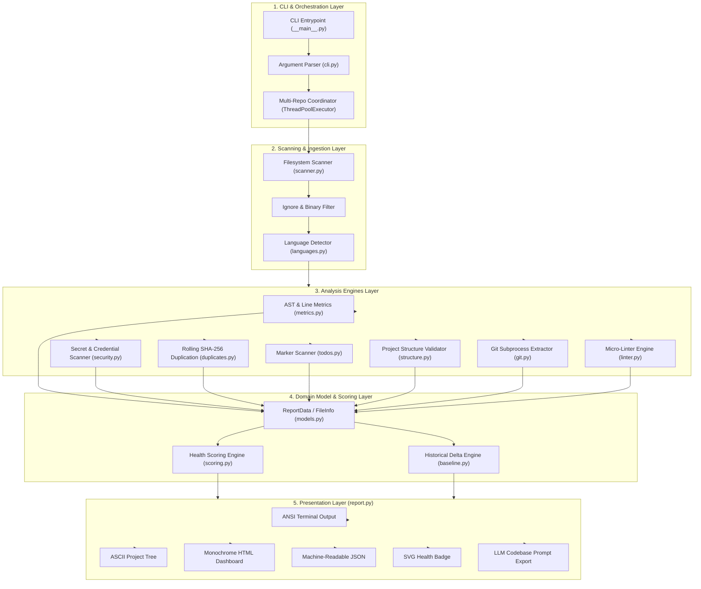
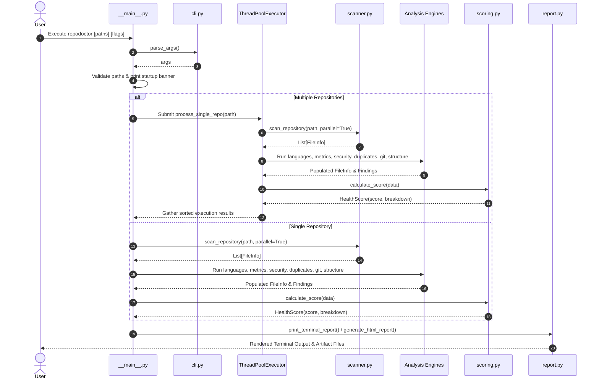
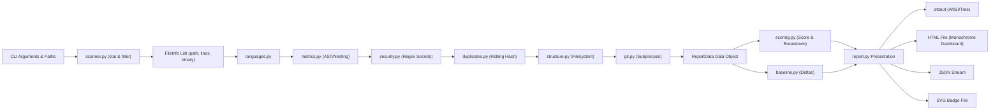

# Complete Project Documentation & Architecture Understanding: RepoDoctor (`repodoctor-cli`)

---

## 1. Executive Summary

**RepoDoctor** (packaged as `repodoctor-cli`) is a production-grade, zero-dependency static analysis and codebase health auditing CLI tool written in pure Python 3. It analyzes software repositories for maintainability, security vulnerabilities, code duplication, project architecture integrity, developer sentiment, code clones, and Git version control dynamics.

```
┌────────────────────────────────────────────────────────────────────────┐
│                              REPO DOCTOR                               │
│        Zero-Dependency Static Analysis Engine & Health Auditor         │
└────────────────────────────────────────────────────────────────────────┘
```

### High-Level Summary
* **Zero Runtime Dependencies**: RepoDoctor relies strictly on the Python Standard Library (`ast`, `concurrent.futures`, `subprocess`, `hashlib`, `re`, `argparse`, `dataclasses`, `sys`, `os`, etc.). It runs in restricted, air-gapped, or minimal CI/CD containers without executing `pip install` for third-party libraries.
* **Multi-Threaded Parallel Execution**: Concurrently walks directory trees and processes file-level metrics across multiple CPU threads, scaling effortlessly to massive multi-thousand-file repositories.
* **Concurrent Multi-Repository Aggregation**: Capable of scanning multiple separate codebases simultaneously (e.g., frontend and backend microservices) in a single invocation, emitting unified terminal, JSON, or standalone HTML dashboard outputs.
* **Self-Contained Artifact Outputs**: Generates machine-readable JSON reports, GitHub-style standalone SVG health badges, and an offline-first Monochrome Terminal style HTML dashboard report.
* **Single-File Compilation**: Includes an internal builder (`build_single_file.py`) that flattens all internal modules into a single portable script (`repodoctor_single.py`).

---

## 2. What This Project Does

### 2.1 The Problem It Solves
Modern software development tooling often suffers from:
1. **Heavy Dependency Chains**: Static linters and code health scanners frequently require dozens of nested dependencies, creating security supply-chain risks, packaging incompatibilities, and long CI build times.
2. **Environment Inflexibility**: Running security and maintainability audits in restricted environments (e.g., bare-metal servers, locked-down containers, ephemeral CI runners without internet access) is hindered when tools demand external package registries.
3. **Fragmented Diagnostics**: Teams must often configure separate tools for secret scanning (e.g., TruffleHog), TODO scanning, cyclomatic complexity estimation, duplicate detection, and Git hotspot tracking.

### 2.2 The Solution
RepoDoctor acts as an all-in-one repository diagnostic suite that evaluates code health instantaneously with standard Python runtime availability.

### 2.3 Who Uses It?
* **Software Engineers & Team Leads**: Performing instant code audits before pull requests or during code reviews.
* **DevOps & CI/CD Engineers**: Embedding lightweight, deterministic quality gates in build pipelines without adding build container dependencies.
* **Open-Source Maintainers**: Evaluating incoming pull requests and generating dynamic repository health badges.
* **AI/LLM Workflows**: Bundling full multi-file codebases into single structured text prompts (`--export-prompt`) for ingestion into LLMs (ChatGPT, Claude).

### 2.4 A Real-World Example
A developer runs a scan across a repository before merging a major feature branch:
```bash
repodoctor /path/to/project --parallel --html audit_report.html --badge health.svg --tree
```
1. RepoDoctor renders an ASCII directory tree of the project.
2. It parallel-scans the filesystem, identifies languages, computes lines of code, and parses Abstract Syntax Trees (AST).
3. It detects hardcoded secrets, duplicate code blocks, and high nesting complexity.
4. It checks Git history for the most volatile "hotspot" file and the top contributor.
5. It computes a deterministic **Health Score (0-100)** with penalty and bonus breakdowns.
6. It writes an offline HTML dashboard to `audit_report.html` and saves `health.svg`.

---

## 3. Repository Structure

Below is the directory structure of the repository, categorized by architectural responsibility.

```text
RepoDoc/
├── repodoctor/                      # Core Package Root
│   ├── __init__.py                  # ⭐ Package initialization & exports
│   ├── __main__.py                  # ⭐ CLI orchestration & multi-repo parallel engine
│   ├── cli.py                       # 🔧 Argument parsing & flag configurations
│   ├── models.py                    # ⭐ Strongly-typed domain dataclasses
│   ├── scanner.py                   # 🔧 Filesystem traversal & multi-threaded file scanner
│   ├── languages.py                 # 📦 Extension-to-language mapping engine
│   ├── metrics.py                   # 🔧 AST complexity & line metric analyzer
│   ├── todos.py                     # 📦 Marker & task scanning (TODO, FIXME, HACK)
│   ├── security.py                  # 🔧 Secret detection & regex credential redactor
│   ├── duplicates.py                # 🔧 Rolling-window SHA-256 code duplication detector
│   ├── linter.py                    # 📦 Micro-linter rule engine
│   ├── structure.py                 # 📦 Project architecture & standard file validator
│   ├── git.py                       # 🔧 Subprocess Git history & hotspot extractor
│   ├── scoring.py                   # 🔧 Health scoring algorithm & penalty engine
│   ├── baseline.py                  # 📦 Baseline comparison & delta calculation engine
│   ├── report.py                    # 🔧 Presentation layer (Terminal, Tree, HTML, Badges)
│   └── spinner.py                   # 📦 Zero-dependency terminal progress bars & spinners
├── tests/                           # 🧪 Test Suite (Built with unittest)
│   ├── __init__.py                  # 🧪 Test package initialization
│   ├── test_cli.py                  # 🧪 Tests for CLI arguments & flag parsing
│   ├── test_scanner.py              # 🧪 Tests for file traversal & binary heuristics
│   ├── test_parallel.py             # 🧪 Tests for multi-threading determinism & worker pools
│   ├── test_languages.py            # 🧪 Tests for language detection
│   ├── test_metrics.py              # 🧪 Tests for AST function/class counting & nesting
│   ├── test_todos.py                # 🧪 Tests for TODO/FIXME detection
│   ├── test_security.py             # 🧪 Tests for secret pattern matching & redaction
│   ├── test_duplicates.py           # 🧪 Tests for SHA-256 rolling block deduplication
│   ├── test_structure.py            # 🧪 Tests for project structure rules
│   ├── test_git.py                  # 🧪 Tests for Git subprocess parsing
│   ├── test_scoring.py              # 🧪 Tests for bonus/penalty scoring bounds
│   ├── test_baseline.py             # 🧪 Tests for historical baseline delta calculations
│   └── test_packaging.py            # 🧪 Tests for PEP 517 metadata & zero-dependency proofs
├── build_single_file.py             # ⚙️ Script to compile single-file standalone distribution
├── pyproject.toml                   # ⚙️ PEP 517 / 518 standard build configuration
├── setup.py                         # ⚙️ Setuptools distribution & script entrypoint config
├── README.md                        # 📚 User & developer documentation
├── STDLIB.md                        # 📚 Technical reference for standard library substitutions
└── .gitignore                       # ⚙️ Git ignore patterns for build & cache artifacts
```

### Detailed Component Categorization

| File / Directory | Category | Purpose | Importance |
| :--- | :--- | :--- | :--- |
| `repodoctor/__main__.py` | ⭐ Critical | Main application entry point, lifecycle management, and multi-repo concurrency coordinator. | High |
| `repodoctor/models.py` | ⭐ Critical | Central data contract defining all domain models (`ReportData`, `FileInfo`, `HealthScore`). | High |
| `repodoctor/scanner.py` | 🔧 Important | Traverses directories, checks binary null-byte headers, and manages file stat pools. | High |
| `repodoctor/metrics.py` | 🔧 Important | Analyzes line metrics (blank/comment/code) and parses Python ASTs for function/class counts. | High |
| `repodoctor/security.py` | 🔧 Important | Scans for private keys, API tokens, `.env` files, and applies safe redactions. | High |
| `repodoctor/duplicates.py` | 🔧 Important | Implements rolling-window SHA-256 hashing to find identical multi-line code blocks. | High |
| `repodoctor/scoring.py` | 🔧 Important | Computes repository health score out of 100 with a deterministic penalty/bonus model. | High |
| `repodoctor/report.py` | 🔧 Important | Renders formatted terminal outputs, ASCII directory trees, SVG badges, and HTML dashboards. | High |
| `repodoctor/git.py` | 🔧 Important | Executes Git subprocess calls to extract commit counts, active branches, and code hotspots. | Medium |
| `repodoctor/cli.py` | 🔧 Important | Defines CLI arguments, options, and help text using `argparse`. | Medium |
| `repodoctor/spinner.py` | 📦 Supporting | Provides terminal animations, braille progress spinners, and progress bars. | Medium |
| `repodoctor/structure.py`| 📦 Supporting | Verifies standard open-source conventions (`README`, `.gitignore`, `LICENSE`, `tests`, CI). | Medium |
| `repodoctor/todos.py` | 📦 Supporting | Scans source lines for code markers (`TODO`, `FIXME`, `HACK`, `BUG`, `XXX`). | Medium |
| `repodoctor/languages.py`| 📦 Supporting | Maps file extensions to programming languages. | Low |
| `repodoctor/baseline.py` | 📦 Supporting | Loads previous JSON reports and calculates regression/improvement deltas. | Low |
| `repodoctor/linter.py` | 📦 Supporting | Contains micro-linter regex and AST rules for language-specific anti-patterns. | Medium |
| `build_single_file.py` | ⚙️ Config | Inlines all modules into a standalone `repodoctor_single.py` script. | Low |
| `pyproject.toml` / `setup.py` | ⚙️ Config | Standard packaging metadata for PyPI deployment (`repodoctor-cli`). | High |

---

## 4. Architecture

RepoDoctor follows a **Pipelined Modular Architecture**. The application is structured into decoupled layers: Command Interface, Concurrent Orchestration, Domain Scanner & Analyzers, Data Model Layer, and Multi-Target Presentation.

### 4.1 Architectural Layers

1. **CLI & Orchestration Layer (`cli.py`, `__main__.py`)**: Handles command-line invocation, validates input paths, manages thread pools for multi-repository targets, and controls logging/spinner lifecycle.
2. **Scanning & Ingestion Layer (`scanner.py`, `languages.py`)**: Traverses the filesystem using `os.walk`, filters ignored directories, detects binary vs. text files via byte-level inspection, and maps language extensions.
3. **Analysis Engines Layer (`metrics.py`, `security.py`, `duplicates.py`, `todos.py`, `structure.py`, `git.py`, `linter.py`)**: Individual static analysis modules that execute concurrently or sequentially on the scanned file metadata.
4. **Domain Model Layer (`models.py`, `scoring.py`, `baseline.py`)**: Stores analysis results in typed dataclasses, runs the scoring heuristic, and computes delta statistics.
5. **Presentation Layer (`report.py`)**: Formats the final `ReportData` models into Terminal ANSI streams, ASCII trees, JSON objects, SVG badges, or HTML dashboards.

### 4.2 Mermaid Architecture Diagram



---

## 5. CLI Architecture

The CLI interface is constructed with Python's standard `argparse` module, supporting both single-target and multi-target analyses.

### 5.1 CLI Options & Flags

| Option / Flag | Type | Default | Description |
| :--- | :--- | :--- | :--- |
| `path` (positional) | `nargs="*"` | `["."]` | One or more directory paths to analyze concurrently. |
| `--parallel`, `-j` | Flag | `False` | Enables `ThreadPoolExecutor` for file scanning within each repository. |
| `--html FILE` | `str` | `""` | Generates a self-contained HTML dashboard written to the specified path. |
| `--json` | Flag | `False` | Emits raw JSON output to `stdout` (suppressing terminal visual banners). |
| `--tree` | Flag | `False` | Renders a terminal ASCII project tree before the summary. |
| `--badge FILE` | `str` | `""` | Generates a Shields.io-compatible standalone SVG health badge. |
| `--export-prompt FILE`| `str` | `""` | Bundles all source files into a formatted text file for LLM prompting. |
| `--baseline FILE` | `str` | `""` | Compares results against a prior JSON scan and outputs +/- delta metrics. |
| `--no-color` | Flag | `False` | Strips all ANSI color sequences for plain-text logs. |
| `--no-animation` | Flag | `False` | Disables live braille spinners and interactive progress bars. |
| `--ignore` | `str` | `""` | Comma-separated list of additional directories or files to ignore. |
| `--large-file-lines` | `int` | `500` | Line threshold above which a file is flagged as "Large File". |
| `--duplicate-lines` | `int` | `8` | Minimum line window length for rolling duplicate detection. |
| `--security` | Flag | `False` | Focus flag for security-specific diagnostics. |
| `--todos` | Flag | `False` | Focus flag for TODO/task diagnostics. |
| `--git` | Flag | `False` | Explicit flag to enable Git metrics (enabled by default when `.git` exists). |
| `--version` | Flag | - | Prints tool version (`repodoctor 1.0.0`). |

### 5.2 Exit Codes
RepoDoctor defines standard semantic exit codes for CI/CD integration:
* `0`: Success — Scan finished cleanly without security secrets or critical duplicate thresholds.
* `1`: Scan Completed with Warnings/Failures — Findings detected or health score below `--fail-under`.
* `2`: Invalid CLI Usage — Target directory does not exist or invalid argument syntax.
* `3`: I/O Failure — Unable to write output files (`--html` or `--export-prompt`).

---

## 6. Commands & Features

### 6.1 Feature Inventory

#### 1. Multi-Repository Concurrent Scanning
* **Purpose**: Analyzes multiple projects in parallel and consolidates or separates reports.
* **Command**: `repodoctor ./frontend ./backend --parallel --html full_report.html`
* **Implementation**: `__main__.py` uses `concurrent.futures.ThreadPoolExecutor(max_workers=...)` to analyze all paths concurrently, capturing each repository's stdout into thread-safe `io.StringIO` buffers and sorting the outputs by initial input order.

#### 2. AST Cyclomatic & Structure Metrics
* **Purpose**: Calculates lines of code, comments, blank lines, class counts, and function counts.
* **Implementation**: `metrics.py` parses Python files via `ast.parse()` to count `ast.FunctionDef`, `ast.AsyncFunctionDef`, and `ast.ClassDef`. For other languages, it uses regex heuristics and computes indentation-based nesting depth (`line_indent // 4`).

#### 3. Rolling-Window SHA-256 Duplication Detection
* **Purpose**: Identifies copy-pasted code blocks across the repository.
* **Implementation**: `duplicates.py` normalizes code lines (stripping whitespace/comments), creates a rolling window of size `min_lines` (default 8), hashes each block with `hashlib.sha256()`, and groups matching hashes into `DuplicateBlock` instances.

#### 4. Credential & Secret Detection
* **Purpose**: Prevents committed API keys, tokens, `.env` files, and private keys.
* **Implementation**: `security.py` tests against high-confidence regular expressions. Any match triggers safe masking via `redact()` (e.g., `sk-1234567890abcdef` $\rightarrow$ `sk-...ef`), preventing secret leakage in terminal logs and HTML reports.

#### 5. Developer Mood Analyzer & Code Clones
* **Purpose**: Analyzes team sentiment and identifies identical files.
* **Implementation**: `__main__.py` scans extracted words against positive/negative sentiment word lists to determine repository mood (`Highly Motivated 🚀`, `Balanced ⚖️`, `Severely Frustrated 😡`). It also uses `difflib.SequenceMatcher` across the top largest files to expose clones with $>80\%$ similarity.

#### 6. Offline Monochrome Terminal HTML Report
* **Purpose**: Generates an interactive, dark-mode, clean report.
* **Implementation**: `report.py` (`generate_html_report`) outputs an offline HTML5 document using a monospace terminal aesthetic without external CSS/JS dependencies.

---

## 7. End-to-End Workflows

### 7.1 Complete Execution Flow



---

## 8. Data Flow



### Data Transformations
1. **Raw Filesystem $\rightarrow$ `FileInfo`**: Path strings are inspected with `os.stat` to extract file size, line counts, and check for null bytes (`\x00`).
2. **`FileInfo` $\rightarrow$ `FileMetrics`**: File contents are parsed by `metrics.py` to extract `code_lines`, `comment_lines`, `blank_lines`, `longest_line`, `num_functions`, and `max_nesting`.
3. **Findings Aggregation $\rightarrow$ `ReportData`**: All intermediate objects (`TodoItem`, `SecurityFinding`, `DuplicateBlock`, `GitInfo`) are gathered into the central `ReportData` dataclass.
4. **`ReportData` $\rightarrow$ Formatted Outputs**: `report.py` converts `ReportData` into ANSI terminal text, JSON, SVG, or HTML.

---

## 9. Core Components & Module Breakdown

### 9.1 `models.py`
Defines all strongly-typed domain structures using `@dataclass`:
* `FileInfo`: Contains path, size, lines, language, binary flag, and associated metrics.
* `FileMetrics`: Stores function counts, class counts, nesting depth, code/comment/blank counts.
* `SecurityFinding`: Stores vulnerability category, confidence, line number, and redacted string.
* `DuplicateBlock`: Stores matched file paths, duplicate line ranges, and similarity score.
* `GitInfo`: Stores branch, commit count, uncommitted changes, top contributor, and hotspot.
* `HealthScore`: Stores final numerical score (`0-100`) and bonus/penalty breakdown.
* `ReportData`: Master container holding the full audit state for a repository.

### 9.2 `scanner.py`
* **Ignore Heuristics**: Built-in ignore list (`.git`, `node_modules`, `__pycache__`, `.venv`, `dist`, `build`, `.idea`, etc.) prevents walking unnecessary directories.
* **Binary Detection**: Reads the first 1024 bytes of each file for null bytes (`b'\x00'`) to instantly skip compiled binaries and images.
* **Concurrency**: When `--parallel` is active, uses `concurrent.futures.ThreadPoolExecutor` with a worker pool of `min(32, (os.cpu_count() or 1) + 4)`.

### 9.3 `scoring.py`
Calculates repository health starting from a base score of **85**:
$$\text{Score} = \text{Base}(85) + \text{Bonuses} - \text{Penalties}$$
* **Bonuses** (Max +15):
  * README present: $+5$
  * Tests directory present: $+5$
  * `.gitignore` present: $+5$
* **Penalties** (Max -85):
  * Large files ($>500$ lines): $-3$ per file (Max $-15$)
  * TODO/FIXME markers: $-1$ per item (Max $-10$)
  * Security findings: $-15$ per finding (Max $-30$)
  * Duplicate code blocks: $-5$ per block (Max $-20$)
  * High nesting complexity ($>4$ levels): $-2$ per file (Max $-10$)
* **Clamping**: Clamped to the range $[0, 100]$.

---

## 10. Most Important Files

Ranked by architectural significance:

1. ⭐⭐⭐⭐⭐ **`repodoctor/__main__.py`**: Main application controller, CLI execution lifecycle, and multi-repo concurrency coordinator.
2. ⭐⭐⭐⭐⭐ **`repodoctor/models.py`**: Central domain dataclasses defining data contracts across all analyzers.
3. ⭐⭐⭐⭐⭐ **`repodoctor/scanner.py`**: Multi-threaded filesystem scanner, binary file filter, and path resolver.
4. ⭐⭐⭐⭐ **`repodoctor/report.py`**: Presentation engine for terminal ANSI rendering, ASCII trees, HTML reports, and SVG badges.
5. ⭐⭐⭐⭐ **`repodoctor/scoring.py`**: Mathematical scoring and penalty calculation engine.
6. ⭐⭐⭐⭐ **`repodoctor/security.py`**: Regex secret scanner and safe credential redaction engine.
7. ⭐⭐⭐ **`repodoctor/metrics.py`**: AST parser and nesting depth metric analyzer.
8. ⭐⭐⭐ **`repodoctor/duplicates.py`**: SHA-256 rolling-window duplication detection algorithm.
9. ⭐⭐⭐ **`repodoctor/git.py`**: Subprocess wrapper for Git metadata, hotspot tracking, and contribution analytics.
10. ⭐⭐ **`repodoctor/spinner.py`**: Zero-dependency braille animation and terminal spinner engine.

> ### ⏱️ 30-Minute Reading Path for New Developers
> 1. `repodoctor/models.py` (Understand the data structures: `ReportData`, `FileInfo`, `HealthScore`).
> 2. `repodoctor/cli.py` (See available arguments and default configurations).
> 3. `repodoctor/__main__.py` (Follow the execution pipeline from `main()` to worker threads).
> 4. `repodoctor/scanner.py` (See how files are traversed and filtered).
> 5. `repodoctor/scoring.py` & `repodoctor/report.py` (See how scores are computed and formatted).

---

## 11. Entry Points & Call Chains

### 11.1 Entry Points
* **Package CLI**: Installed console script `repodoctor` (points to `repodoctor.__main__:main`).
* **Python Module Invocation**: `python3 -m repodoctor [args]`.
* **Standalone Single-File Script**: `python3 repodoctor_single.py [args]`.

### 11.2 Call Chain

```text
main() [__main__.py]
 │
 ├── parse_args() [cli.py]
 │
 ├── ThreadPoolExecutor.submit(process_single_repo, path) [__main__.py]
 │    │
 │    ├── scan_repository() [scanner.py]
 │    │    └── _process_file() [scanner.py]
 │    │         └── is_binary_file() [scanner.py]
 │    │
 │    ├── detect_languages() [languages.py]
 │    │
 │    ├── analyze_metrics() [metrics.py]
 │    │    └── analyze_python_ast() [metrics.py]
 │    │
 │    ├── scan_todos() [todos.py]
 │    ├── scan_security() [security.py]
 │    │    └── redact() [security.py]
 │    │
 │    ├── scan_duplicates() [duplicates.py]
 │    │    └── normalize_line() [duplicates.py]
 │    │
 │    ├── check_project_structure() [structure.py]
 │    ├── get_git_info() [git.py]
 │    │    └── run_git() [git.py]
 │    │
 │    └── calculate_score() [scoring.py]
 │
 ├── print_terminal_report() [report.py]
 │    ├── print_project_tree() [report.py]
 │    └── fmt_delta() [report.py]
 │
 ├── generate_html_report() [report.py]
 ├── get_json_report() [report.py]
 └── sys.exit(exit_code)
```

---

## 12. Dependencies

RepoDoctor requires **ZERO runtime dependencies**. It runs entirely using standard library modules.

| Dependency Type | Module / Tool | Purpose | Standard Library? |
| :--- | :--- | :--- | :--- |
| **Runtime** | `ast` | Parses Python code trees to count classes and functions. | Yes (Built-in) |
| **Runtime** | `concurrent.futures` | Implements thread pools for multi-repo and file scanning. | Yes (Built-in) |
| **Runtime** | `subprocess` | Executes native Git commands for repository metadata. | Yes (Built-in) |
| **Runtime** | `hashlib` | Computes SHA-256 hashes for rolling code duplicate windows. | Yes (Built-in) |
| **Runtime** | `re` | Matches security secrets, code smells, and TODO markers. | Yes (Built-in) |
| **Runtime** | `argparse` | Parses CLI flags, options, and positional path arguments. | Yes (Built-in) |
| **Runtime** | `dataclasses` | Provides typed domain model structures. | Yes (Built-in) |
| **Runtime** | `difflib` | Computes file similarity ratios for clone detection. | Yes (Built-in) |
| **Testing** | `unittest` | Unit test execution and assertion framework. | Yes (Built-in) |
| **Build** | `setuptools`, `wheel` | PEP 517 build backend for PyPI packaging. | Standard tooling |

---

## 13. Configuration

RepoDoctor is configured dynamically through CLI flags and filesystem presence.

| Configuration Item | Source | Default | Required? | Purpose |
| :--- | :--- | :--- | :--- | :--- |
| `path` | CLI Argument | `["."]` | No | List of repository root folders to analyze. |
| `large_file_lines` | `--large-file-lines` | `500` | No | Threshold for flagging large source files. |
| `duplicate_lines` | `--duplicate-lines` | `8` | No | Minimum line length for duplicate blocks. |
| `ignore` | `--ignore` | `""` | No | Comma-separated list of custom ignore paths. |
| `fail_under` | Internal API | `0` | No | Minimum score threshold below which exit code is 1. |
| `baseline` | `--baseline` | `""` | No | Path to previous JSON scan for delta tracking. |

---

## 14. External Integrations

RepoDoctor interacts with external systems exclusively via local standard interfaces:
* **Local Git Binary**: Calls `git` via `subprocess.run` (e.g., `git rev-parse`, `git status --porcelain`, `git shortlog -sn HEAD`, `git log --name-only`).
  * *Error Handling*: If `git` is not installed or the directory is not a Git repository, `git.py` catches `CalledProcessError`, `FileNotFoundError`, and `OSError`, returning `GitInfo(available=False)` without crashing.
* **Local Filesystem**: Reads source files with `open(path, 'r', encoding='utf-8', errors='ignore')`.

---

## 15. Database & Storage

RepoDoctor is stateless and point-in-time. It requires no database:
* **In-Memory**: All file records, metric objects, and findings exist in Python memory during execution.
* **File Output**: Writes output artifacts (`.html`, `.json`, `.svg`, `.txt`) only when requested via explicit flags (`--html`, `--json`, `--badge`, `--export-prompt`).

---

## 16. Error Handling

RepoDoctor applies defensive programming to ensure scans complete even when encountering malformed source files:
* **Encoding Fault Tolerance**: File reading uses `encoding='utf-8', errors='ignore'` to prevent crashes on non-UTF-8 characters.
* **Non-Blocking AST Errors**: `metrics.py` catches `SyntaxError` when parsing invalid Python files and falls back to regex analysis.
* **Subprocess Isolation**: Git commands suppress `stderr` (`stderr=subprocess.DEVNULL`) and catch process errors gracefully.
* **Buffered Thread-Safe Output**: Multi-repo outputs are captured in `io.StringIO` buffers, preventing corrupted stdout if worker threads exit unexpectedly.

---

## 17. Logging & Observability

* **Live Spinners**: `spinner.py` provides interactive braille progress spinners (`⠋⠙⠹...`) and progress bars (`[████░░░░] 50%`) when connected to an interactive TTY.
* **TTY Detection**: Automatically detects non-interactive terminals (`sys.stdout.isatty() == False`), suppressing carriage returns and ANSI color codes for clean CI/CD logging.
* **Execution Metrics**: Records wall-clock execution time and outputs concurrency metrics (e.g., `⚡ Concurrently analyzed 2 repositories in 1.11s`).

---

## 18. Testing

The repository contains 13 test files covering 28 test cases executed via Python's standard `unittest`:

```bash
python3 -m unittest discover -s tests -v
```

### Test Suite Matrix

| Test Suite | Location | Verified Functionality |
| :--- | :--- | :--- |
| `TestCLI` | `tests/test_cli.py` | Default arguments, custom flags, multi-path list parsing. |
| `TestScanner` | `tests/test_scanner.py` | Directory traversal, ignored folders, binary file filtering. |
| `TestParallelScanning` | `tests/test_parallel.py` | Thread pool determinism, sequential vs. parallel file count parity. |
| `TestLanguages` | `tests/test_languages.py` | Extension matching for supported programming languages. |
| `TestMetrics` | `tests/test_metrics.py` | Line counting, Python AST class/function detection, nesting. |
| `TestTodos` | `tests/test_todos.py` | Regex extraction of `TODO`, `FIXME`, `HACK`, `BUG` tags. |
| `TestSecurity` | `tests/test_security.py` | Credential pattern matching, `.env` file detection, value redaction. |
| `TestDuplicates` | `tests/test_duplicates.py` | SHA-256 rolling window deduplication accuracy. |
| `TestStructure` | `tests/test_structure.py` | Validation of README, .gitignore, LICENSE, and CI configs. |
| `TestGit` | `tests/test_git.py` | Git availability checks and metadata extraction. |
| `TestScoring` | `tests/test_scoring.py` | Score calculation, penalty bounds, bonus additions ($0-100$). |
| `TestBaseline` | `tests/test_baseline.py` | Comparison against previous JSON scan and delta calculations. |
| `TestPackagingEntrypoint` | `tests/test_packaging.py` | Entrypoint execution, `--help` output, zero-dependency validation. |

---

## 19. Security

### 19.1 Implemented Security Controls
* **Safe Credential Redaction**: All detected secrets are redacted via `redact()` before outputting to terminal or HTML.
* **No Shell Interpolation**: Subprocess calls in `git.py` use list arguments (`["git", "status", "--porcelain"]`), avoiding `shell=True` and preventing command injection.
* **Static Analysis Only**: Source code is parsed statically via AST and regex; code is never dynamically executed or imported (`no eval()/importlib of target code`).
* **Air-Gapped Operation**: No outbound HTTP/network requests are made.

### 19.2 Potential Security Considerations
* **Regex Secret Detection**: Regex-based scanners can produce false positives (e.g., test fixtures) or miss highly obfuscated credentials.
* **Path Traversal**: RepoDoctor reads files within paths provided by the user on the CLI.

---

## 20. Performance & Optimization

* **Parallel Filesystem Traversal**: File stat and line counting utilize `ThreadPoolExecutor` with up to 32 worker threads.
* **Fast Binary Rejection**: Checking the first 1 KB for null bytes (`\x00`) avoids reading megabyte-sized binary files into memory.
* **Rolling Hashing**: Duplication detection computes SHA-256 hashes only for non-empty normalized lines.
* **Multi-Repo Concurrency**: Multiple repositories passed on the CLI are analyzed in parallel worker threads, reducing total scan time to the duration of the single slowest repository.

---

## 21. Build & Installation

### 21.1 Installation

#### Option 1: Install from PyPI
```bash
pip install repodoctor-cli
```

#### Option 2: Install from Source (Editable Mode)
```bash
git clone https://github.com/05tanish/RepoDoc.git
cd RepoDoc
pip install -e .
```

#### Option 3: Standalone Single-File (No Installation Required)
```bash
python3 build_single_file.py
python3 repodoctor_single.py /path/to/project
```

### 21.2 Package Build Verification
```bash
python3 -m build
```
Generates distribution artifacts in `dist/`:
* `repodoctor-1.0.1-py3-none-any.whl`
* `repodoctor-1.0.1.tar.gz`

---

## 22. Release & Deployment

* **Package Index**: Published to PyPI as `repodoctor-cli`.
* **Versioning**: Follows Semantic Versioning (`major.minor.patch`), currently at `1.0.1`.
* **Target Python Versions**: Python 3.8, 3.9, 3.10, 3.11, 3.12+.

---

## 23. Development & Git Workflow

* **Repository**: Forked at `05tanish/RepoDoc` (upstream: `harshk94138167777-png/RepoDoc`).
* **Branch Strategy**: Development on `main` feature branches with PRs merged upstream.
* **Contribution Standards**:
  1. Maintain 100% zero-dependency constraint (stdlib only).
  2. Ensure all 28 unit tests pass (`python3 -m unittest discover -s tests`).
  3. Rebuild `repodoctor_single.py` when modifying core package modules.

---

## 24. Design Decisions

1. **Zero External Dependencies (*Confirmed Fact*)**:
   * *Decision*: Replaced libraries like `rich`, `requests`, `gitpython`, `pydantic`, `pytest` with standard library equivalents (`sys.stdout`, `subprocess`, `dataclasses`, `unittest`).
   * *Trade-off*: Requires writing custom terminal formatting and AST traversal, but ensures instant installation and air-gapped security.
2. **Dataclass-Centric Modeling (*Confirmed Fact*)**:
   * *Decision*: Use Python `@dataclass` rather than dicts or Pydantic models.
   * *Trade-off*: Clean, type-annotated code without third-party dependencies.
3. **Monochrome Terminal HTML Design (*Confirmed Fact*)**:
   * *Decision*: Replaced neon gradients with a minimalist dark-mode monospace aesthetic.
   * *Trade-off*: Professional, distraction-free reporting that renders offline.

---

## 25. Code Quality

* **Modularity**: High. Each diagnostic domain (security, duplicates, git, metrics) is isolated in its own file.
* **Typing**: Type hints (`typing.List`, `Optional`, `Dict`, `Tuple`) are used across `models.py` and analyzer signatures.
* **Testability**: Pure functions (e.g., `normalize_line`, `calculate_score`, `redact`, `detect_languages`) allow fast unit testing without mocks.

---

## 26. Technical Debt & Codebase Observations

* 🟠 **Dead Code in `repodoctor/linter.py`** (*Medium Priority*):
  * In `linter.py`, line 86 contains an early `return smells`. Lines 88–227 are unreachable dead code, and lines 151–226 duplicate lines 11–85. Removing the dead block will clean up the module.
* 🟢 **Duplicate Filename in Models vs Scanner** (*Low Priority*):
  * `FileInfo` contains both `path` (absolute) and `relative_path`. In a few modules, string operations redundantly re-extract `os.path.basename`.

---

## 27. Complete System Map

```text
User Terminal Invocation
  │
  ▼
CLI Parser (cli.py: parse_args)
  │
  ▼
Main Orchestrator (__main__.py: main)
  │
  ├─► Multi-Repo ThreadPoolExecutor (__main__.py: process_single_repo)
  │     │
  │     ├─► Filesystem Scanner (scanner.py: scan_repository)
  │     │     ├─► Ignore Filtering (.git, node_modules, dist)
  │     │     └─► Binary Null-Byte Filter (scanner.py: is_binary_file)
  │     │
  │     ├─► Language Detector (languages.py: detect_languages)
  │     ├─► AST & Line Analyzer (metrics.py: analyze_metrics)
  │     ├─► Marker Scanner (todos.py: scan_todos)
  │     ├─► Security Engine (security.py: scan_security)
  │     ├─► Duplication Detector (duplicates.py: scan_duplicates)
  │     ├─► Project Structure Validator (structure.py: check_project_structure)
  │     ├─► Git History Extractor (git.py: get_git_info)
  │     └─► Health Scorer (scoring.py: calculate_score)
  │
  ▼
Report Generation (report.py)
  ├─► Terminal ANSI Report (report.py: print_terminal_report)
  ├─► ASCII Directory Tree (report.py: print_project_tree)
  ├─► Monochrome HTML Dashboard (report.py: generate_html_report)
  ├─► JSON Machine Stream (report.py: get_json_report)
  └─► SVG Health Badge (report.py)
```

---

## 28. Beginner Learning Path

### Level 1: Core Concepts & Data Model
1. Read `repodoctor/models.py` to understand domain structures (`ReportData`, `FileInfo`, `HealthScore`).
2. Read `STDLIB.md` to learn why each standard library module was selected.

### Level 2: Execution & CLI
3. Read `repodoctor/cli.py` to understand all input arguments and flags.
4. Read `repodoctor/__main__.py` to trace how `main()` initializes the engine and coordinates worker threads.

### Level 3: Analyzers & Diagnostics
5. Read `repodoctor/scanner.py` to see directory traversal and binary filtering.
6. Read `repodoctor/scoring.py` to see how the health score is calculated.
7. Read `repodoctor/security.py` and `repodoctor/duplicates.py` to inspect scanning algorithms.

### Level 4: Testing & Distribution
8. Review `tests/test_cli.py` and `tests/test_scoring.py` to see unit test conventions.
9. Inspect `build_single_file.py` to understand single-file module inlining.

---

## 29. Quick Reference

* **Main Purpose**: Zero-dependency static analysis and codebase health auditing CLI.
* **Entry Point**: `repodoctor/__main__.py:main` (CLI command: `repodoctor`).
* **Supported Languages**: Python, JavaScript, TypeScript, Java, Go, Rust, C/C++, C#, Kotlin, Ruby, PHP, HTML, CSS, JSON, YAML, Markdown, Shell, SQL.
* **Standard Commands**:
  * Single repo scan: `repodoctor .`
  * Multi-repo parallel scan: `repodoctor ./repo1 ./repo2 --parallel`
  * HTML dashboard: `repodoctor . --html report.html`
  * JSON export: `repodoctor . --json`
  * Run test suite: `python3 -m unittest discover -s tests -v`
  * Build single-file executable: `python3 build_single_file.py`

---

## 30. Final Mental Model

> **"Think of RepoDoctor as a self-contained doctor's checkup for your code repository that needs no installation tools, has no dependencies, and produces a complete medical chart in seconds."**

### How It Works in 6 Simple Steps:
1. **Command Ingestion**: The user specifies one or more target folders and output preferences.
2. **Parallel Discovery**: The scanner traverses folders concurrently, filtering out binaries, caches, and dependency trees.
3. **Multi-Disciplinary Diagnosis**: Seven diagnostic modules analyze metrics, AST complexity, secrets, code duplication, Git volatility, project structure, and TODOs.
4. **Health Scoring**: The scoring engine evaluates findings against base criteria to produce a numerical health score ($0-100$).
5. **Unified Reporting**: The presentation engine formats findings into terminal text, ASCII trees, SVG badges, JSON, or an offline HTML report.
6. **Delivery**: Results are delivered to the developer or CI/CD runner with semantic exit codes.
