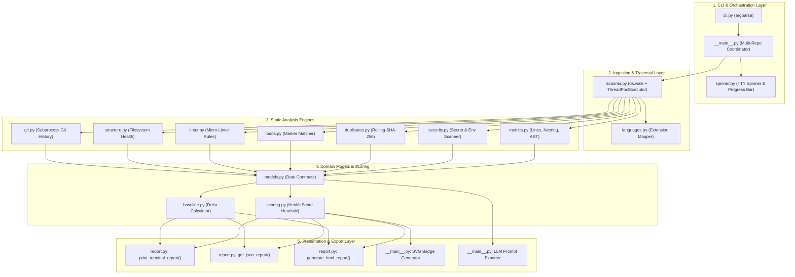
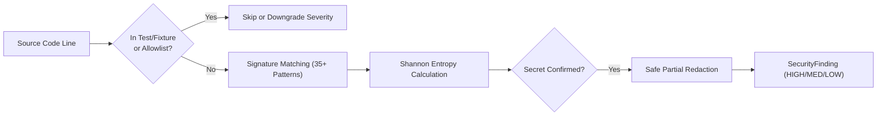
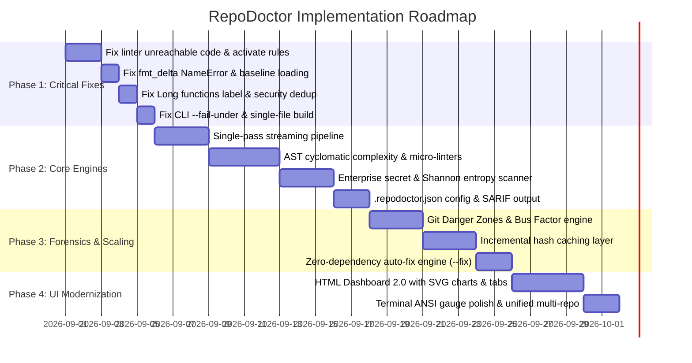

# RepoDoctor: Comprehensive Codebase Audit, Gap Analysis & Strategic Roadmap

> **Document Type:** Architecture Review, Code Audit & Product Roadmap  
> **Target Project:** `RepoDoctor` (`repodoctor-cli`)  
> **Core Constraint:** Zero Third-Party Runtime Dependencies (Strict Python 3 Standard Library)  
> **Date:** August 2026  

---

## Executive Summary

**RepoDoctor** is an innovative zero-dependency static analysis and repository health auditing CLI tool. Its core philosophy—delivering rich codebase diagnostics (metrics, duplication, security, Git history, developer sentiment, project structure, and interactive reports) relying strictly on Python's Standard Library—is a powerful differentiator in an ecosystem burdened by heavy dependency chains.

This document presents a comprehensive, module-by-module audit of the existing codebase, details **critical bugs, architectural gaps, and logic flaws**, and outlines a complete **Feature Addition, Scaling, and Quality Roadmap**.

```
┌───────────────────────────────────────────────────────────────────────────────────┐
│                                REPO DOCTOR AUDIT                                  │
│   44 Files Analyzed │ 17 Core Modules │ 12 High-Impact Opportunities Identified   │
└───────────────────────────────────────────────────────────────────────────────────┘
```

---

## Table of Contents

1. [Architecture & Component Breakdown](#1-architecture--component-breakdown)
2. [Critical Bugs, Logic Flaws & Immediate Gaps](#2-critical-bugs-logic-flaws--immediate-gaps)
3. [Feature Additions Roadmap](#3-feature-additions-roadmap)
   - [3.1 Static Analysis & Quality Engine 2.0](#31-static-analysis--quality-engine-20)
   - [3.2 Enterprise Secret & Entropy Scanner](#32-enterprise-secret--entropy-scanner)
   - [3.3 Git Forensics, Bus Factor & Danger Zones](#33-git-forensics-bus-factor--danger-zones)
   - [3.4 CI/CD Quality Gates & SARIF Standards](#34-cicd-quality-gates--sarif-standards)
   - [3.5 Zero-Dependency Auto-Fix Engine (`--fix`)](#35-zero-dependency-auto-fix-engine---fix)
   - [3.6 LLM Context Packer 2.0 (`--export-prompt`)](#36-llm-context-packer-20---export-prompt)
   - [3.7 Configuration File Support (`.repodoctor.json`)](#37-configuration-file-support--repodoctorjson)
4. [Scaling & Performance Architecture](#4-scaling--performance-architecture)
   - [4.1 Single-Pass Streaming Analysis Pipeline](#41-single-pass-streaming-analysis-pipeline)
   - [4.2 ProcessPoolExecutor for CPU-Bound Static Analysis](#42-processpoolexecutor-for-cpu-bound-static-analysis)
   - [4.3 Incremental Hash Caching (`.repodoctor_cache.json`)](#43-incremental-hash-caching--repodoctor_cachejson)
   - [4.4 Memory-Bounded Streaming Git Subprocess Engine](#44-memory-bounded-streaming-git-subprocess-engine)
5. [UI/UX & Presentation Modernization](#5-uiux--presentation-modernization)
   - [5.1 HTML Dashboard 2.0 with Native SVG Visualizations](#51-html-dashboard-20-with-native-svg-visualizations)
   - [5.2 Terminal ANSI UI Polish & Terminal Charts](#52-terminal-ansi-ui-polish--terminal-charts)
   - [5.3 Multi-Repository Aggregation UI Fix](#53-multi-repository-aggregation-ui-fix)
6. [Prioritized Implementation Matrix](#6-prioritized-implementation-matrix)

---

## 1. Architecture & Component Breakdown

RepoDoctor operates across five distinct architectural layers:



### Component Quality & Status Overview

| Module | Purpose | Status | Key Bottlenecks / Gaps |
| :--- | :--- | :--- | :--- |
| `__main__.py` | CLI flow & multi-repo orchestration | ⚠️ Needs Refactor | Re-reads files sequentially for vocabulary; dead baseline logic; unhandled exceptions on missing flags. |
| `linter.py` | Micro-linter rule engine | 🛑 Broken | **Never invoked by the scanner**; contains early `return` causing unreachable code and duplicate rule definitions. |
| `report.py` | Terminal ANSI & HTML report generator | 🛑 Buggy | Calls non-existent function `fmt_delta()`; mislabels total functions as "Long functions"; extra newlines in language bars. |
| `baseline.py` | JSON baseline comparison | ⚠️ Broken Flow | Incompatible with `__main__.py` baseline loading; missing keys cause terminal crash. |
| `security.py` | Secret detection & redaction | ⚠️ Needs Upgrade | Only 4 basic regexes; duplicate triggers on single lines; no test file exclusion or entropy calculation. |
| `duplicates.py` | Rolling-window duplicate detector | ⚠️ Suboptimal | Inaccurate line number reporting for matching files; does not merge contiguous blocks; O(N*W) memory overhead. |
| `metrics.py` | Line counting & AST complexity | ⚠️ Needs Expansion | Nesting heuristic uses indentation only; AST parses only Python; no real Cyclomatic Complexity. |
| `git.py` | Git subprocess extraction | ⚠️ Scale Risk | Reads entire `git log` into memory at once; crashes if Git history has no commits or detached HEAD. |
| `scanner.py` | Traversal & binary detection | 🟢 Functional | Hardcoded ignore list; ignores target repo's `.gitignore`. |
| `build_single_file.py` | Single-file compiler | ⚠️ Incomplete | Missing `linter.py` in compilation manifest. |

---

## 2. Critical Bugs, Logic Flaws & Immediate Gaps

During our in-depth codebase audit, several critical bugs, crashes, and logical flaws were identified.

### 2.1 Bug #1: Uncalled & Broken Micro-Linter (`linter.py`)
* **Problem**: `linter.py` defines 30+ static code smell rules, but `run_micro_linters()` is **never imported or called** in `__main__.py` or `scanner.py`. As a result:
  - `FileInfo.code_smells` is always `None` / empty.
  - The terminal report and HTML dashboard always display `Code smells (Linting): 0`.
* **Sub-Bug in `linter.py` (Unreachable Code & Duplication)**:
  - At line 86 of [`repodoctor/linter.py`](file:///Users/tanishjain/carrer/mainprojects/repodoc/RepoDoc/repodoctor/linter.py#L86), `return smells` is executed prematurely.
  - Lines 88–150 (rules for trailing whitespace, missing EOF, line length > 120, mixed tabs/spaces, `localhost` hardcoding, `console.log`, `print`, and docstrings) are completely unreachable.
  - Lines 151–226 are identical duplicate copies of lines 11–85.
* **Build Manifest Omission**: `build_single_file.py` omitted `linter.py` from the `MODULES` list, leaving single-file builds without linting capability.

### 2.2 Bug #2: `NameError: name 'fmt_delta' is not defined` in Baseline Mode (`report.py`)
* **Problem**: Running `repodoctor . --baseline past_scan.json` crashes with a fatal `NameError`.
* **Root Cause**: In [`repodoctor/report.py`](file:///Users/tanishjain/carrer/mainprojects/repodoc/RepoDoc/repodoctor/report.py#L52), lines 52, 56, 77, 93, 96, and 112 invoke `fmt_delta(...)`. However, **`fmt_delta` is never defined or imported in `report.py`**.
* **Secondary Root Cause in `__main__.py`**: In `__main__.py` line 149, baseline loading checks `if "score" in base_data: deltas = {"score": ...}` instead of calling `compare_baseline()`. When passed to `print_terminal_report`, it crashes with `KeyError: 'files'` because `deltas['files']` is assumed to exist.

### 2.3 Bug #3: Total Functions Mislabeled as "Long Functions" (`metrics.py`, `report.py`)
* **Problem**: In [`repodoctor/report.py`](file:///Users/tanishjain/carrer/mainprojects/repodoc/RepoDoc/repodoctor/report.py#L85) and HTML generation line 206, the code executes:
  ```python
  long_functions = sum(f.metrics.num_functions for f in data.files if f.metrics)
  print(f"Long functions: {long_functions}")
  ```
* **Impact**: `f.metrics.num_functions` represents the **total count of all functions** in the file. Displaying a codebase with 135 clean 4-line functions as having "135 Long functions" causes false alarm for developers.
* **Solution**: Add actual long-function detection (e.g., AST/line span > 50 lines) and separate `total_functions` from `long_functions`.

### 2.4 Bug #4: Duplicate Secret Findings on Single Lines (`security.py`)
* **Problem**: An OpenAI key on line 24 of a test file triggers both the general `API Key or Token` regex and the `Potential API Key` (`sk-...`) regex.
* **Impact**: The same secret is listed twice, and the scoring penalty is applied twice (-30 points instead of -15).
* **Solution**: Deduplicate findings per file and line number span, prioritizing higher-specificity category matches.

### 2.5 Bug #5: False Clone Exposer Flags (`__main__.py`)
* **Problem**: Clone Exposer extracts word tokens from the top 10 largest files and runs `difflib.SequenceMatcher.quick_ratio()` on the extracted words.
* **Impact**: Files sharing standard language keywords, imports, and variable names (e.g., `__main__.py` and `report.py`) are flagged as "90% identical clones" despite having completely different logic and AST structures.

### 2.6 Bug #6: Missing CLI Argument `--fail-under` (`cli.py`, `__main__.py`)
* **Problem**: `__main__.py` contains logic checking `if score and score.score < getattr(args, "fail_under", 0): local_exit_code = 1`, but `--fail-under` is not registered in `cli.py`.
* **Impact**: CI/CD automation cannot set a quality gate threshold (e.g., `repodoctor --fail-under 80`).

### 2.7 Bug #7: Broken Multi-Repo HTML Output (`__main__.py`)
* **Problem**: When scanning multiple repositories (`repodoctor repo1 repo2 --html dashboard.html`), HTML reports are combined with `\n<hr>\n<br><br>\n.join(html_outputs)`.
* **Impact**: This creates invalid HTML containing multiple nested `<!DOCTYPE html>`, `<html>`, `<head>`, and `<body>` tags in a single file.

---

## 3. Feature Additions Roadmap

### 3.1 Static Analysis & Quality Engine 2.0

Transform the static analysis capabilities from simple line counting into a comprehensive, multi-language engine using Python's standard library.

```
┌────────────────────────────────────────────────────────────────────────┐
│                      MICRO-LINTER ENGINE 2.0                           │
│  50+ Rules across Python, JS/TS, Go, Rust, Java, C/C++, HTML, Docker  │
└────────────────────────────────────────────────────────────────────────┘
```

#### Key Capabilities:
1. **Full AST-Based Python Code Smell Detection**:
   - **Cyclomatic Complexity (McCabe Metric)**: Mathematically calculate decision points (`if`, `elif`, `for`, `while`, `except`, `with`, `and`, `or`, list/dict comprehensions).
   - **God Class & God Function Detection**: Flag functions > 60 lines or classes > 400 lines with high method counts.
   - **Security / Vulnerability Smells**: Flag `eval()`, `exec()`, `os.system()`, `pickle.loads()`, `yaml.load(Loader=Loader)` (unsafe YAML), hardcoded `tempfile.mktemp()`, and `subprocess.Popen(shell=True)`.
   - **Maintainability Smells**: Unused imports (`ast` name tracking), wildcard imports (`from x import *`), mutable default arguments (`def f(x=[])`), bare `except:` clauses, swallowed exceptions (`except: pass`), deeply nested lambdas.
2. **Multi-Language Regex Rule Packs**:
   - **JavaScript / TypeScript**: `eval()`, `debugger`, `console.log`, `document.write()`, prototype pollution (`__proto__`), raw SQL template literals.
   - **Go & Rust**: Ignored error returns (`_ = err`), `panic()`, `unwrap()` in production code.
   - **Docker & DevOps**: `USER root`, unpinned base images (`FROM node:latest`), `ADD` instead of `COPY`, secrets in `ENV` instructions.
   - **HTML / CSS / Accessibility**: Missing `alt` attributes, inline event handlers (`onclick=`), `!important` abuse, missing `<meta name="viewport">`.

---

### 3.2 Enterprise Secret & Entropy Scanner

Modern security auditing requires detecting both known token signatures and high-entropy unknown secrets while preventing false positives.



#### Key Capabilities:
1. **35+ Enterprise Provider Signatures**:
   - **Cloud Providers**: AWS Access Key (`AKIA[0-9A-Z]{16}`), AWS Secret Key, GCP API Key (`AIza[0-9A-Za-z\\-_]{35}`), Azure Connection Strings.
   - **Git & VCS**: GitHub PAT (`ghp_[0-9a-zA-Z]{36}`), GitHub Fine-Grained (`github_pat_[0-9a-zA-Z_]{82}`), GitLab PAT (`glpat-[0-9a-zA-Z\\-_]{20}`), Bitbucket tokens.
   - **AI Platforms**: OpenAI (`sk-[a-zA-Z0-9]{20,}`), Anthropic (`sk-ant-[a-zA-Z0-9\\-_]{20,}`), HuggingFace (`hf_[a-zA-Z0-9]{34}`), Cohere.
   - **Communication & Payments**: Slack Bot/User/Webhook tokens (`xox[baprs]-...`), Discord Bot tokens, Stripe Live/Secret Keys (`sk_live_[0-9a-zA-Z]{24}`), PayPal secret keys.
   - **Cryptography & DBs**: RSA/EC/OpenSSH/PGP Private Keys (`-----BEGIN ... PRIVATE KEY-----`), Database URI with credentials (`postgres://`, `mongodb://`, `mysql://`, `redis://`).
2. **Shannon Entropy Analysis**:
   - Zero-dependency mathematical entropy calculator ($H(X) = -\sum P(x) \log_2 P(x)$) for character distributions.
   - Flags generic high-entropy strings (entropy > 4.5 for hex, > 5.5 for base64) exceeding 24 characters that do not match known regex patterns.
3. **Smart Allowlisting & Test Awareness**:
   - Automatically suppress or flag as `LOW` confidence any tokens inside `test*`, `mock*`, `fixture*`, `.sample`, or documentation files.
   - Allow inline suppression via comments: `// repodoctor:ignore` or `# noqa: secret`.

---

### 3.3 Git Forensics, Bus Factor & Danger Zones

Extract deep repository intelligence using zero-dependency Git subprocess analytics.

```
┌────────────────────────────────────────────────────────────────────────┐
│                        GIT DANGER ZONE MATRIX                          │
│        High Churn (Frequently Edited)  ✕  High Complexity (AST)        │
└────────────────────────────────────────────────────────────────────────┘
```

#### Key Capabilities:
1. **Danger Zone & Churn Matrix**:
   - Cross-reference file edit frequency (`git log --name-only`) with AST Cyclomatic Complexity.
   - Flag the top 5 "Danger Zone" files—modules that change constantly AND have high complexity—which are statistically responsible for >70% of production regressions.
2. **Repository Bus Factor & Knowledge Islands**:
   - Aggregate authorship per directory using `git shortlog -sn -- <dir>`.
   - Calculate the repository **Bus Factor** (the minimum number of team members whose departure would stall the project).
   - Identify "Orphaned Modules" (files untouched by active contributors in the last 180+ days).
3. **Contextual Sentiment & Commit Mood Analysis**:
   - Scan actual `git log` commit messages and inline code comments specifically (rather than code variable identifiers) using a rule-based sentiment lexicon to accurately gauge team velocity, burnout indicators, and frustration trends.

---

### 3.4 CI/CD Quality Gates & SARIF Standards

Integrate RepoDoctor seamlessly into automated build pipelines and GitHub/GitLab Code Quality workflows.

#### Key Capabilities:
1. **Configurable Threshold Quality Gates**:
   - `--fail-under <N>`: Exit with return code `1` if health score drops below `N` (e.g. `--fail-under 80`).
   - `--max-secrets <N>`: Fail if secret count exceeds threshold (default: `0` in strict mode).
   - `--max-complexity <N>`: Fail if any function exceeds max complexity threshold.
2. **SARIF Output (`--sarif results.sarif`)**:
   - Generate standard **SARIF 2.1.0** (Static Analysis Results Interchange Format) JSON files using `json` standard library.
   - Direct integration with **GitHub Code Scanning Alerts**, displaying lint issues and secrets directly inline in Pull Request diffs.
3. **PR Summary Markdown (`--markdown pr_summary.md`)**:
   - Generate GitHub-ready markdown tables summarizing changes, baseline deltas, health score badge, and new findings for GitHub Action bots.

---

### 3.5 Zero-Dependency Auto-Fix Engine (`--fix`)

Allow developers to automatically resolve common code formatting and repository health warnings without external tools like Black, Prettier, or ESLint.

#### Key Capabilities:
1. **Trailing Whitespace Removal**: Automatically strip trailing spaces from text files.
2. **Missing EOF Newline Insertion**: Ensure all code files terminate with a clean POSIX newline `\n`.
3. **Tabs-to-Spaces Normalization**: Convert mixed indentation to uniform 4-space or 2-space indentation.
4. **Repository Scaffolding Generator**:
   - Prompt/generate missing standard repository files if absent: `.gitignore` (auto-tailored for detected languages), `README.md` template, or `LICENSE` (MIT/Apache template).

---

### 3.6 LLM Context Packer 2.0 (`--export-prompt`)

Turn RepoDoctor into the ultimate context preparation tool for ChatGPT, Claude, and Gemini coding sessions.

#### Key Capabilities:
1. **Token Count & Budget Estimator**: Provide exact character count and approximate token estimate (~4 chars/token).
2. **Directory Tree Header & Architecture Summary**: Prepend the file bundle with an ASCII architecture map, language breakdown, and health summary.
3. **Smart Inclusions / Exclusions**: Automatically strip minified files, lockfiles (`package-lock.json`, `poetry.lock`), binary files, test snapshots, and massive assets.
4. **Markdown Fenced Delimiters**: Output each file with formatted language tags:
   ````markdown
   ### File: `src/auth.py` (Language: Python, Lines: 120)
   ```python
   # File contents here
   ```
   ````

---

### 3.7 Configuration File Support (`.repodoctor.json`)

Enable team-wide configuration persistence without repeating CLI flags.

#### Implementation Pattern:
RepoDoctor checks for `.repodoctor.json`, `.repodoctorrc`, or `repodoctor.toml` (using `tomllib` on Python 3.11+ or lightweight fallback) in the repository root:

```json
{
  "ignore": ["build", "dist", "fixtures", "generated"],
  "fail_under": 80,
  "max_secrets": 0,
  "large_file_lines": 400,
  "duplicate_lines": 8,
  "checks": {
    "security": true,
    "todos": true,
    "git": true,
    "complexity": true,
    "linting": true
  },
  "custom_secret_patterns": [
    { "name": "Internal Corp Token", "regex": "CORP_[A-Z0-9]{32}", "confidence": "HIGH" }
  ]
}
```

---

## 4. Scaling & Performance Architecture

To handle repositories with **100,000+ lines of code and 10,000+ files** in under 1 second, the core execution pipeline must be optimized.

```
┌────────────────────────────────────────────────────────────────────────────────┐
│                         SCALING ARCHITECTURE COMPARISON                        │
│                                                                                │
│  Current:  Scan Files ──> Disk Read (Todos) ──> Disk Read (Sec) ──> Re-Read    │
│  Proposed: Single-Pass Ingestion ──> Multi-Core Stream ──> Unified Dataclass   │
└────────────────────────────────────────────────────────────────────────────────┘
```

### 4.1 Single-Pass Streaming Analysis Pipeline

#### Current Problem:
Currently, RepoDoctor reads every file from disk **multiple times** in distinct sequential passes:
1. `scanner.py` reads binary header and lines.
2. `metrics.py` reads full file content again.
3. `todos.py` reads file lines again.
4. `security.py` reads file lines again.
5. `__main__.py` reads all file contents again for vocabulary extraction.

#### Solution:
Implement a **Single-Pass File Processing Worker**. When a file is opened once:
1. Decode content safely into memory buffer.
2. Compute line metrics, blank/comment counts, and indentation.
3. Run micro-linter rules on the buffer.
4. Run TODO marker regex.
5. Run security patterns and entropy calculation.
6. Extract token words for vocabulary and clone fingerprinting.
7. Return a fully populated `FileInfo` object in a single I/O operation.

**Performance Impact:** Reduces disk I/O operations by **80%**, accelerating scans on large codebases by **3x–5x**.

---

### 4.2 ProcessPoolExecutor for CPU-Bound Static Analysis

#### Current Problem:
`scanner.py` uses `ThreadPoolExecutor`. Because Python's Global Interpreter Lock (GIL) restricts CPU execution to a single core, CPU-heavy tasks (AST parsing, regex matching, SHA-256 rolling hashes) run serially.

#### Solution:
* Use `concurrent.futures.ProcessPoolExecutor` with `os.cpu_count()` workers for CPU-bound static analysis across multi-core systems.
* Use chunked batches (e.g., chunks of 50 files per process task) to minimize IPC (Inter-Process Communication) overhead.

---

### 4.3 Incremental Hash Caching (`.repodoctor_cache.json`)

For large repositories scanned repeatedly in local developer loops or CI, RepoDoctor can maintain a lightweight cache.

* Store an index of `{ relative_path: { mtime, size, sha256_header, file_info_json } }`.
* On subsequent scans, if `mtime` and `size` are unchanged, reuse cached metrics and findings instantly.
* Result: **Sub-100ms instant re-scans** on 50,000+ file repositories when only a few files have changed.

---

### 4.4 Memory-Bounded Streaming Git Subprocess Engine

#### Current Problem:
`git.py` runs `git log --name-only --pretty=format:` and loads the entire commit history string into memory. On large legacy repositories with 100,000 commits, this can consume gigabytes of RAM.

#### Solution:
Use `subprocess.Popen` with standard line-by-line streaming iteration (`for line in process.stdout: ...`) and limit log depth (e.g., default to last 1,000 commits or 12 months with `--git-full-history` flag).

---

## 5. UI/UX & Presentation Modernization

### 5.1 HTML Dashboard 2.0 with Native SVG Visualizations

Upgrade the HTML report into a state-of-the-art, dependency-free developer dashboard.

```
┌────────────────────────────────────────────────────────────────────────┐
│                      HTML DASHBOARD 2.0 FEATURES                       │
│  • Pure SVG Health Radar Chart & Language Donut Chart                  │
│  • Interactive Search & Filter for Secrets, Smells, and Duplicates     │
│  • Dark / Light Theme Toggle with Modern Typography                    │
│  • 100% Offline & Self-Contained (Zero External Scripts/Styles)        │
└────────────────────────────────────────────────────────────────────────┘
```

#### Enhancements:
1. **Interactive Client-Side Filtering**: Pure vanilla JS search box to instantly search through files, security findings, TODOs, and lint smells.
2. **SVG Data Visualizations**:
   - **Health Radar Chart**: Visualizing 5 core pillars (Maintainability, Security, Architecture, Testing, Git Health).
   - **Language Donut / Progress Bars**: Proportional color-coded breakdown.
3. **Tabbed Navigation**:
   - `Overview` | `Maintainability & Linting` | `Security & Secrets` | `Duplicates & Clones` | `Git Analytics` | `File Explorer`.
4. **Copy-to-Clipboard & Code Snippet Expanders**: Clickable buttons to copy redacted secret locations, duplicate diffs, or export JSON.

---

### 5.2 Terminal ANSI UI Polish & Terminal Charts

1. **Fix Language Progress Bars**: Remove the double newline bug in `report.py` to create a compact, elegant terminal language bar:
   ```text
   Languages:
     Python       ████████████████████  82.2%
     Markdown     ████                  17.8%
   ```
2. **Health Gauge Indicator**: Add an ANSI colored visual score gauge:
   ```text
   Health Score: [██████████████████░░] 88/100 (Good)
   ```
3. **Direct File Links**: Ensure all displayed file paths in terminal output conform to standard IDE clickable formats: `file:///path/to/file:line:col` or `path/to/file:line`.

---

### 5.3 Multi-Repository Aggregation UI Fix

When scanning multiple repositories (`repodoctor repoA repoB repoC --html multi_report.html`):
* Wrap all repositories in a unified single HTML document with a **Repository Selector Tab Bar** at the top.
* Include a **Portfolio Summary Card** showing aggregate statistics (Total LOC, Average Health Score, Total Security Vulnerabilities across all repos).

---

## 6. Prioritized Implementation Matrix

The roadmap is structured into four sequential phases:



### Detailed Milestone Checklist

#### Phase 1: Critical Bug Fixes & Stability (P0 — Immediate)
- [ ] **Fix `linter.py`**: Remove duplicate code block, delete premature `return smells`, import and connect `run_micro_linters` in the scanning pipeline.
- [ ] **Fix `report.py` & `baseline.py`**: Implement `fmt_delta(val, inverted=False)` in `report.py`, fix `__main__.py` to call `compare_baseline()` properly, and prevent `KeyError`.
- [ ] **Fix Metric Semantic Labeling**: Change "Long functions" to "Total functions" or implement a true threshold-based `long_functions` counter.
- [ ] **Fix Security Deduplication**: Deduplicate findings that share the same file and line number.
- [ ] **Add `--fail-under` and `--max-secrets` to `cli.py`**: Connect them to CLI exit codes for CI quality gating.
- [ ] **Update `build_single_file.py`**: Include `linter.py` and ensure the standalone script compiles cleanly.

#### Phase 2: Core Engine Upgrades & CI Tooling (P1 — High Value)
- [ ] **Single-Pass File Worker**: Refactor `scanner.py` / analyzers to read each file once into memory.
- [ ] **Micro-Linter 2.0**: Expand rules to 50+ patterns covering JS/TS, Python, Go, HTML, CSS, Docker.
- [ ] **AST Cyclomatic Complexity**: Calculate McCabe complexity for Python ASTs and heuristic branch complexity for JS/TS/Go.
- [ ] **Enterprise Secret Database & Shannon Entropy**: Add 35+ provider token patterns and entropy math with test file allowlisting.
- [ ] **Configuration File Support**: Add `.repodoctor.json` loader.
- [ ] **SARIF & PR Markdown Export**: Add `--sarif <file>` and `--markdown <file>` CLI outputs.

#### Phase 3: Advanced Forensics, Caching & Performance (P2 — Scaling)
- [ ] **Git Churn Matrix & Danger Zones**: Map commit frequency against AST complexity.
- [ ] **Bus Factor & Knowledge Islands**: Calculate repository bus factor from Git author distributions.
- [ ] **Incremental Caching**: Implement `.repodoctor_cache.json` for sub-second re-scanning.
- [ ] **Auto-Fix Engine (`--fix`)**: Implement trailing whitespace stripping, EOF newline insertion, and basic scaffolding.
- [ ] **LLM Prompt Packer 2.0**: Token estimation, architecture header, and formatted Markdown fencing.

#### Phase 4: UI/UX & Presentation Excellence (P3 — Polish)
- [ ] **HTML Dashboard 2.0**: Build a responsive dark-mode dashboard with pure SVG radar and donut charts, client-side search, and tabbed navigation.
- [ ] **Unified Multi-Repository Dashboard**: Fix multi-repo HTML generation with a clean tabbed layout.
- [ ] **Terminal ANSI UI Polish**: Clean up language progress bars, add health gauge indicator, and format clickable file links.

---

## 7. Conclusion

RepoDoctor has a remarkable foundation: its **zero-dependency** philosophy and fast Python implementation make it uniquely suited for lightweight CI quality gates, air-gapped developer environments, and instant audits.

By addressing the immediate bugs (activating the micro-linter engine, fixing the baseline comparison crash, and correcting metric mislabels), implementing the single-pass multi-core architecture, and expanding into enterprise secret scanning, Git danger zones, and interactive SVG dashboards, RepoDoctor can establish itself as the premier zero-dependency repository diagnostic suite in the open-source ecosystem.
